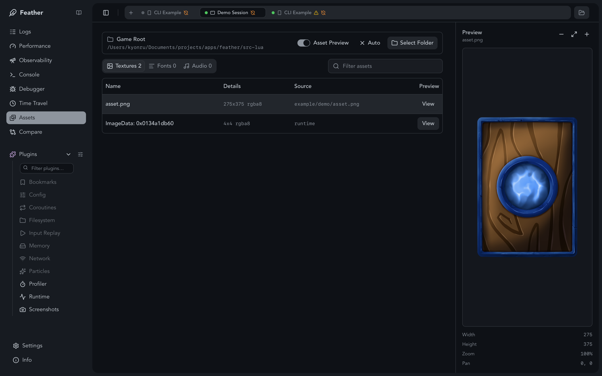
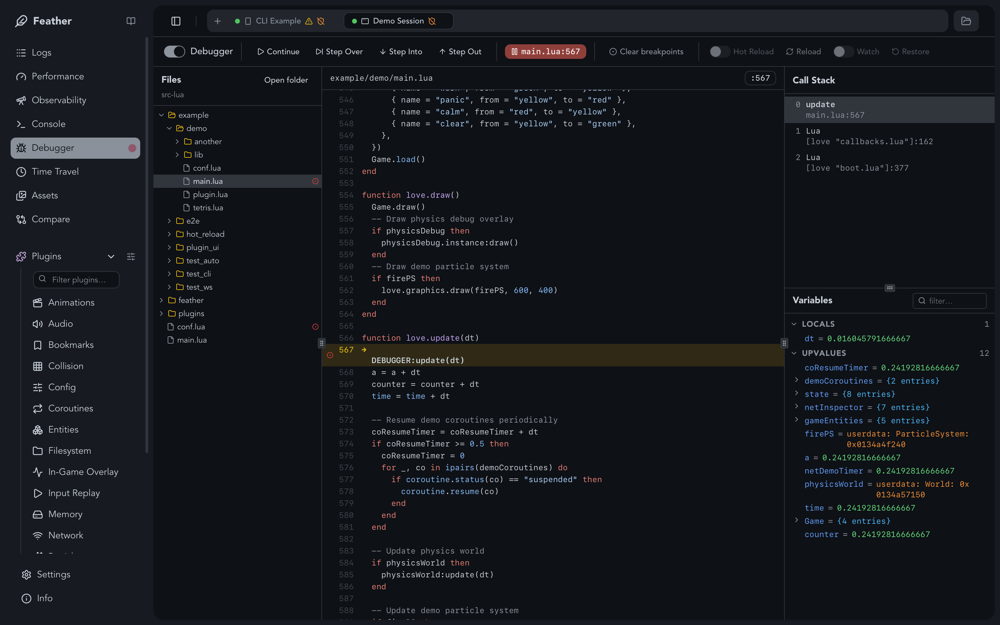

# Feather — CLI Debugging, Inspection, and Builds for LÖVE

Feather is a CLI for debugging, inspecting, and manage packages for [LÖVE](https://love2d.org) games.

It gives you a live window into your running game _(logs, variables, errors, performance)_ without touching your game's release build. Inspired by [LoveBird](https://github.com/rxi/lovebird) and [Flipper](https://github.com/facebook/flipper).

The goal is to make the day-to-day loop of writing and testing a LÖVE game faster: less time adding print statements and restarting, more time actually building.

**[📖 Documentation](https://kyonru.github.io/feather)** · [Releases](https://github.com/Kyonru/feather/releases) · [Changelog](CHANGELOG.md) · [Contributing](CONTRIBUTING.md)

---

## What it does

- **Live log viewer** — See `print()` output in real time without a terminal window.
- **Variable inspection** — Watch values update as the game runs.
- **Error capturing** — Errors are caught and shown with a full stack trace.
- **Step debugger** — Breakpoints, step over/into/out, call stack, local variable inspection.
- **Console / REPL** — Execute Lua in the running game (opt-in, requires an `apiKey`).
- **Plugin system** — 18+ built-in plugins (collision debug, animation inspector, audio debug, particle editor, and more). Plugins define their UI in Lua; the desktop app renders it automatically.
- **Multi-session** — Connect multiple games at the same time.
- **Mobile and platform builds** — CLI-managed web, Android, iOS, Windows, macOS, Linux, and SteamOS workflows.
- **Screenshots & GIF capture** — Built-in capture plugin.
- **Log file viewer** — Open `.featherlog` files for offline inspection.
- **CLI** — No Lua changes needed to run, debug, build, or clean up love2d games.
  - **Package Manager** — Install packages from a curated list of popular love2D packages.

---





---

## Quick Start

Install the Feather desktop app and CLI:

1. Download the desktop app from [Releases](https://github.com/Kyonru/feather/releases).
2. Install the CLI:

```bash
npm install -g @kyonru/feather
```

Initialize your project, open the Feather app, then run the game:

```bash
feather init path/to/my-game
feather run path/to/my-game
```

Feather is injected by the CLI for dev runs and debug builds, so your game code does not need a manual `require` for any target.

Optional vendor setup for web, mobile, and packaged desktop workflows:

```bash
feather build vendor add web --dir path/to/my-game
feather run path/to/my-game --target web

feather build vendor add android --dir path/to/my-game
feather run path/to/my-game --target android

feather build vendor add ios --dir path/to/my-game
feather run path/to/my-game --target ios
```

For all build vendors, including desktop packaging runtimes:

```bash
feather build vendor add all --dir path/to/my-game
```

Build release artifacts from the same CLI flow:

```bash
feather build love --dir path/to/my-game
feather build android --dir path/to/my-game --release
feather build ios --dir path/to/my-game --release
feather build windows --dir path/to/my-game
feather build macos --dir path/to/my-game
feather build linux --dir path/to/my-game
feather build steamos --dir path/to/my-game
```

For more commands and options:

```bash
feather --help
feather run --help
```

See the [CLI docs](docs/cli.md) for `feather run`, `feather doctor`, `feather build`, and `feather upload`.

---

## Package manager

Feather includes a curated installer for common LÖVE libraries. It is not a general package manager — it is a hand-picked catalog of known-good libraries with verified SHA-256 checksums and a lockfile you can commit.

```sh
feather package install anim8       # install a library
feather package install             # restore everything in feather.lock.json
feather package audit               # verify checksums of installed files
feather package list                # browse the catalog
```

Available libraries include anim8, bump, hump, lume, flux, inspect, middleclass, classic, push, sti, and windfield. See [packages/README.md](packages/README.md) for the full list and command reference.

---

## [Documentation](https://kyonru.github.io/feather)

- [Installation](docs/installation.md)
- [CLI](docs/cli.md)
- [Configuration](docs/configuration.md)
- [Usage](docs/usage.md) — observers, logging, console, step debugger
- [Plugins](docs/plugins.md)
- [Packages](packages/README.md)
- [Recommendations](docs/recommendations.md) — security, performance, release builds

---

## Built-in Lua dependencies

- [Hump Class](https://github.com/vrld/hump/blob/master/class.lua)
- [Inspect](https://github.com/kikito/inspect.lua)
- [json.lua](https://github.com/rxi/json.lua)
- [log.lua](https://github.com/rxi/log.lua)
- [ws.lua](https://github.com/flaribbit/love2d-lua-websocket)

---

## Credits

- [LoveBird](https://github.com/rxi/lovebird) by rxi — original inspiration
- [Love-Dialogue](https://github.com/Miisan-png/Love-Dialogue) by Miisan-png — plugin system reference
- [HUMP](https://github.com/vrld/hump), [anim8](https://github.com/kikito/anim8), [flux](https://github.com/rxi/flux), [bump.lua](https://github.com/kikito/bump.lua), [lua-state-machine](https://github.com/kyleconroy/lua-state-machine)

---

## License

The license applies to products that directly replicate the logic or purpose of this tool. It does not apply to games built using it as a development tool.

See [LICENSE.md](LICENSE.md).

## AI usage

The architecture and planning of this tool is my own work. The main goal of this tool is to improve developer experience, meaning providing utilities to save time for my own developer experience and hopefully others. AI autocompletion is used for the creation of some of the features in this tool. This is not an AI driven tool nor a product designed by AI. This is a devtool made by an indie dev for indie devs nothing else. All generated code is reviewed by me. But I understand some people are not comfortable with AI involvement in any form. I respect that.
