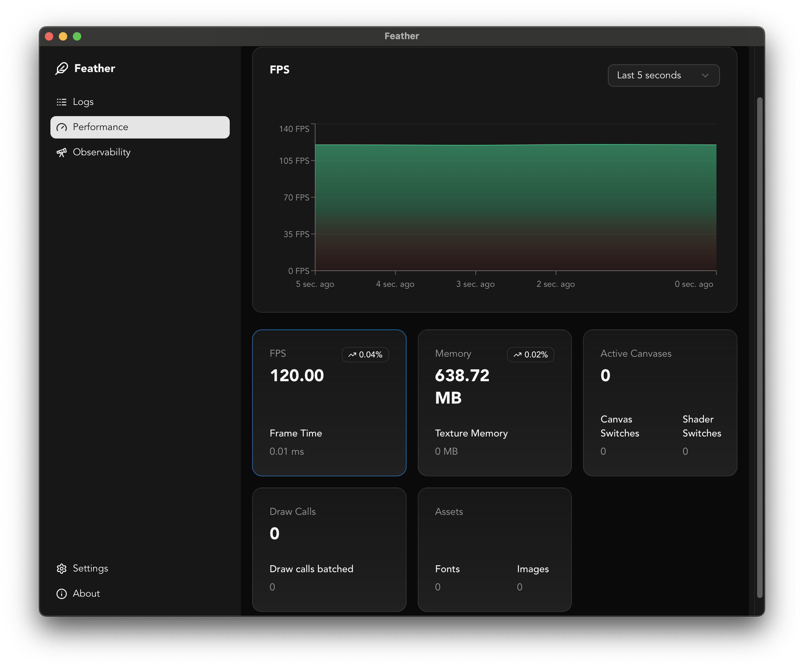

# Feather 🪶 — Debug & Inspect Tool for LÖVE (love2d)

Feather is an extensible debug tool for [LÖVE](https://love2d.org) projects, inspired by [LoveBird](https://github.com/rxi/lovebird).
It lets you **inspect logs, variables, performance metrics, and errors in real-time** over a network connection — perfect for debugging on desktop or mobile without stopping the game.

---

## ✨ Features

- 📜 **Live log viewer** — See `print()` output instantly in your browser.
- 🔍 **Variable inspection** — Watch values update in real-time.
- 🚨 **Error capturing** — Automatically catch and display errors with optional delivery delay.
- 🌐 **Remote access** — Connect via a browser from localhost or whitelisted IPs.
- ⚡ **Performance-friendly** — Configurable update interval to avoid frame drops.
- 🔌 **Plugin support** — Extend with custom data inspectors and views using React (Lua support for custom views coming soon).

---





## 📦 Installation

1. **Download Feather**

- Download the latest release from the [releases page](https://github.com/Kyonru/feather/releases)
- Copy the `feather/` folder and put it in your project folder
- Or install it via [Luarocks](https://luarocks.org/modules/kyonru/feather)

  ```bash
  luarocks install feather
  ```

1. **Require Feather**

   ```lua
   local Feather = require "feather" -- or the location of the feather folder
   ```

---

## 🚀 Usage

### Basic Setup

```lua
local FeatherDebugger = require "feather"

local debugger = FeatherDebugger({
  debug = Config.__IS_DEBUG, -- Make sure to only run in debug mode
  wrapPrint = true,
  defaultObservers = true,
  autoRegisterErrorHandler = true,
})

function love.update(dt)
  debugger:update(dt) -- Required for processing requests
end
```

---

## ⚙️ Configuration

`Feather:init(config)` accepts the following options:

| Option                     | Type       | Default             | Description                                                                                          |
| -------------------------- | ---------- | ------------------- | ---------------------------------------------------------------------------------------------------- |
| `debug`                    | `boolean`  | `false`             | Enable or disable Feather entirely.                                                                  |
| `host`                     | `string`   | `"*"`               | Host address to bind the server to.                                                                  |
| `port`                     | `number`   | `4004`              | Port to listen on.                                                                                   |
| `baseDir`                  | `string`   | `""`                | Base directory path for file references and deeplinking to vs code, useful for multi-project setups  |
| `wrapPrint`                | `boolean`  | `false`             | Wrap `print()` calls to send to Feather's log viewer.                                                |
| `whitelist`                | `table`    | `{ "127.0.0.1" }`   | List of IPs allowed to connect.                                                                      |
| `maxTempLogs`              | `number`   | `200`               | Max number of temporary logs stored before rotation.                                                 |
| `updateInterval`           | `number`   | `0.1`               | Interval between sending updates to clients.                                                         |
| `defaultObservers`         | `boolean`  | `false`             | Register built-in variable watchers.                                                                 |
| `errorWait`                | `number`   | `3`                 | Seconds to wait for error delivery before showing LÖVE's handler.                                    |
| `autoRegisterErrorHandler` | `boolean`  | `false`             | Replace LÖVE's `errorhandler` to capture errors.                                                     |
| `errorHandler`             | `function` | `love.errorhandler` | Custom error handler to use.                                                                         |
| `plugins`                  | `table`    | `{}`                | List of plugin modules to load. (Support Coming soon)                                                |
| `captureScreenshot`        | `boolean`  | `false`             | Capture screenshots on error. WARNING: This impact performance and may cause lags. Use with caution. |
| `apiKey`                   | `string`   | `""`                | API key to use for remote debugging.                                                                 |

---

## 🔗 Connecting

When running your game with Feather enabled, you'll see:

```text
Listening on 127.0.0.1:4004
```

Install the feather app from the [releases page](https://github.com/Kyonru/feather/releases), it will automatically connect to your game.

---

## 🛠 Development Tips

- Only enable `debug = true` in development builds — disable it for release for performance and security.
- Use `wrapPrint = true` to capture all `print()` logs automatically. `print` function will be wrapped with custom logic to send logs to Feather.
- Add custom variable observers to monitor your game's state.

---

## 📦 Dependencies

- [Hump Class](https://github.com/vrld/hump/blob/master/class.lua)
- [Inspect](https://github.com/kikito/inspect.lua)
- [json.lua](https://github.com/rxi/json.lua)

---

## Documentation

### Observers

Observers are a way to inspect variables values in real-time. They are useful for debugging and observing game state.

```lua
  debugger:observe("Awesome player instance", player)
```

### Log

Feather will automatically capture and log print() calls in real-time, using the `output` type. You can also manually log using the `log` and `print` functions.

```lua
  debugger:print("Something happened")
```

```lua
  debugger:log({
    type = "awesome_log_type",
    str = "Something happened",
  })
```

### Trace

Feather automatically includes trace in errors and logs. You can also manually log traces using the `trace` function.

```lua
  debugger:trace("Something happened")
```

### Error Logging

Feather will automatically capture and log errors in real-time. You can also manually log errors using the `error` function.

```lua
  debugger:error("Something went wrong")
```

## Plugins

Feather comes with a plugin system that allows you to extend its functionality with custom data inspectors. Check out the [Feather Plugins](docs/plugins.md) repository for more information.

### TL;DR

Minimal example of a debugger file to load feather

```lua
-- debugger.lua
local FeatherDebugger = require("lib.feather")
local FeatherPluginManager = require("lib.feather.plugin_manager")
local LuaStateMachinePlugin = require("lib.feather.plugins.state-machine")
local HumpSignalPlugin = require("lib.feather.plugins.signal")
local ScreenshotPlugin = require("lib.feather.plugins.screenshots")

local debugger = {}

function debugger:load()
  debugger.feather = FeatherDebugger({
    debug = true, -- Make sure to only run while on development
    apiKey = "debugger",
    wrapPrint = true,
    defaultObservers = true,
    captureScreenshot = true,
    autoRegisterErrorHandler = true,
    errorWait = 10,
    baseDir = "game",
    plugins = {
      FeatherPluginManager.createPlugin(LuaStateMachinePlugin, "lua-state-machine", {
        --- https://github.com/kyleconroy/lua-state-machine
        machine = StateMachine,
      }),
      FeatherPluginManager.createPlugin(HumpSignalPlugin, "hump.signal", {
        -- https://hump.readthedocs.io/en/latest/signal.html
        signal = Signal,
        register = {
          "emit",
          "register",
          "remove",
          "emitPattern",
          "registerPattern",
          "removePattern",
          "clearPattern",
        },
      }),
      FeatherPluginManager.createPlugin(ScreenshotPlugin, "screenshots", {
        screenshotDirectory = "screenshots", -- output folder for captures
        fps = 60, -- frames per second for GIFs
        gifDuration = 5, -- default duration of GIFs in seconds
      }),
    },
  })
end

function debugger:update(dt)
  debugger.feather:update(dt)
end

return debugger
```

## Recommendations

### Security

the `apiKey` option is used to protect your game from unauthorized access. You can use it to remotely connect to your game and debug it. To use it, you need to set the `apiKey` option to a string value and then pass it to the debugger constructor. For example:

```lua
local debugger = FeatherDebugger({
  apiKey = "your-api-key",
})
```

In the feather app, you will need to set the `apiKey` option to the same value as the one you set in the game. This option is highly recommended.

### Performance

Feather is not meant to be used in production / final builds. It is meant to be used during development and debugging. To improve performance, you can set the `debug` option to `false` in the game.

### In game observability

- [OverlayStats](https://github.com/Oval-Tutu/bootstrap-love2d-project/blob/main/game/lib/overlayStats.lua) by [Oval-Tutu](https://github.com/Oval-Tutu) is a great way to visualize your game's performance in real-time on the game, the performance plugin is inspired by it.

## 📜 License

Feel free to use and remix this project for personal, educational, or non-commercial fun.

Just don’t sell it, don’t make forks that let others sell it, and don’t use it for AI training — unless I say it’s okay.

Full license: See [LICENSE.md](LICENSE.md)

---

## 🙏 Credits

Inspired by [LoveBird](https://github.com/rxi/lovebird) by rxi, with added flexibility, plugin support, and modern LÖVE integration.
