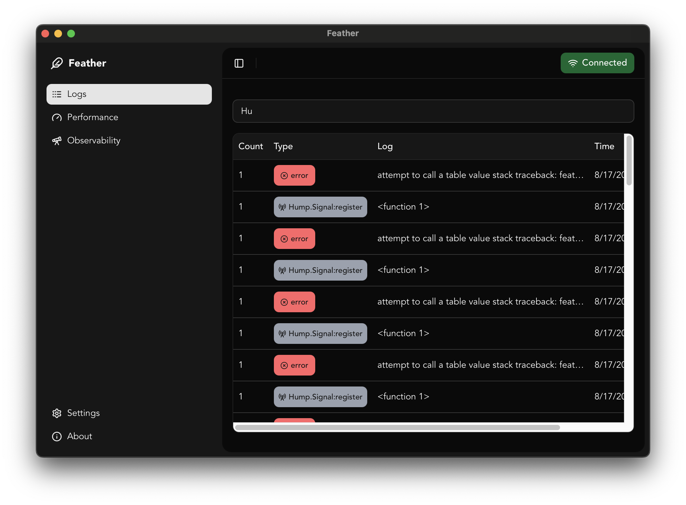

# Feather 🪶 — Debug & Inspect Tool for LÖVE (love2d)

Feather is a lightweight, extensible debug tool for [LÖVE](https://love2d.org) projects, inspired by [LoveBird](https://github.com/rxi/lovebird).
It lets you **inspect logs, variables, performance metrics, and errors in real-time** over a network connection — perfect for debugging on desktop or mobile without stopping the game.

---

## ✨ Features

- 📜 **Live log viewer** — See `print()` output instantly in your browser.
- 🔍 **Variable inspection** — Watch values update in real-time.
- 🚨 **Error capturing** — Automatically catch and display errors with optional delivery delay.
- 🌐 **Remote access** — Connect via a browser from localhost or whitelisted IPs.
- ⚡ **Performance-friendly** — Configurable update interval to avoid frame drops.
- 🔌 **Plugin support** — Extend with custom data inspectors and views using React (Lua support for custom views coming soon).

---




## 📦 Installation

1. **Download Feather**
   Copy the `feather` folder into your project folder.

2. **Require Feather**

   ```lua
   local Feather = require "feather"
   ```

---

## 🚀 Usage

### Basic Setup

```lua
function love.load()
  Feather:init({
    debug = true,           -- Enable/disable Feather
    wrapPrint = true,        -- Capture print() calls
    autoRegisterErrorHandler = true, -- Automatically catch errors
    errorHandler = customerrorhandler, -- Custom error handler, if not, a copy of LÖVE's error handler will be used
  })
end

function love.update(dt)
  Feather:update(dt) -- Required for processing requests
end
```

---

## ⚙️ Configuration

`Feather:init(config)` accepts the following options:

| Option                      | Type        | Default              | Description |
|-----------------------------|-------------|----------------------|-------------|
| `debug`                     | `boolean`   | `false`              | Enable or disable Feather entirely. |
| `host`                      | `string`    | `"*"`                | Host address to bind the server to. |
| `port`                      | `number`    | `4004`               | Port to listen on. |
| `baseDir`                   | `string`    | `""`                 | Base directory path for file references and deeplinking to vs code |
| `wrapPrint`                  | `boolean`   | `false`              | Wrap `print()` calls to send to Feather's log viewer. |
| `whitelist`                 | `table`     | `{ "127.0.0.1" }`    | List of IPs allowed to connect. |
| `maxTempLogs`                | `number`    | `200`                | Max number of temporary logs stored before rotation. |
| `updateInterval`             | `number`    | `0.1`                | Interval between sending updates to clients. |
| `defaultObservers`           | `boolean`   | `false`               | Register built-in variable watchers. |
| `errorWait`                  | `number`    | `3`                  | Seconds to wait for error delivery before showing LÖVE's handler. |
| `autoRegisterErrorHandler`   | `boolean`   | `false`              | Replace LÖVE's `errorhandler` to capture errors. |
| `errorHandler`               | `function`  | `love.errorhandler`  | Custom error handler to use. |
| `plugins`                    | `table`     | `{}`                 | List of plugin modules to load. (Support Coming soon) |

---

## 🔗 Connecting

When running your game with Feather enabled, you'll see:

```text
Listening on 127.0.0.1:4004
```

Install the feather app or locally build the web app and visit:

```bash
npm install
npm run web
```

Open a web browser and visit:

```url
http://127.0.0.1:4004
```

---

## 🛠 Development Tips

- Only enable `debug = true` in development builds — disable it for release for performance and security.
- Use `wrapPrint = true` to capture all `print()` logs automatically. `print` function will be wrapped with custom logic to send logs to Feather.
- Add custom variable observers to monitor your game's state.

---

## 📜 License

Feel free to use and remix this project for personal, educational, or non-commercial fun.

Just don’t sell it, don’t make forks that let others sell it, and don’t use it for AI training — unless I say it’s okay.

Full license: See [LICENSE.md](LICENSE.md)

---

## 🙏 Credits

Inspired by [LoveBird](https://github.com/rxi/lovebird) by rxi, with added flexibility, plugin support, and modern LÖVE integration.
