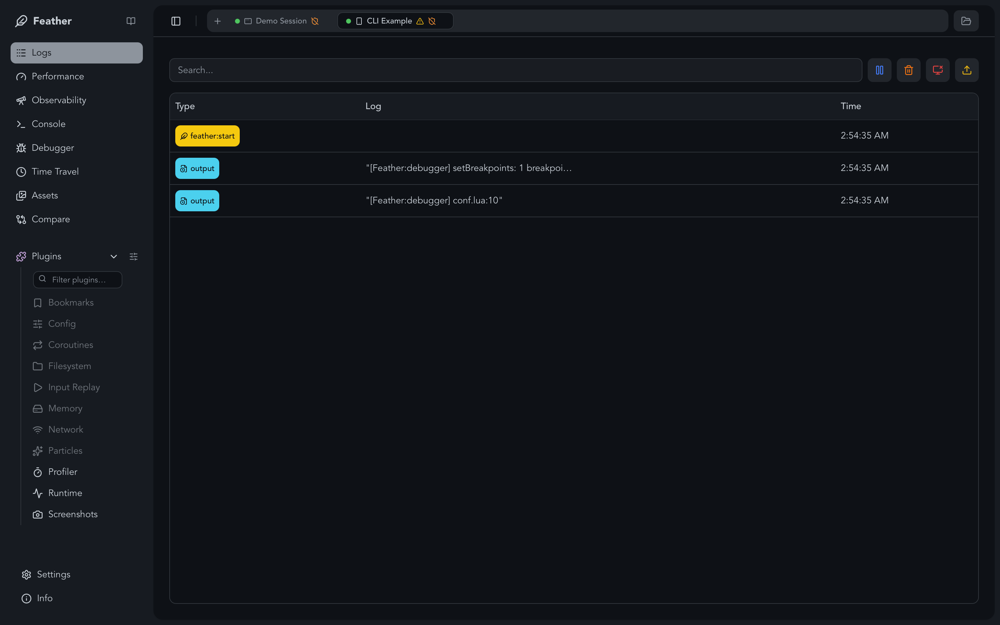
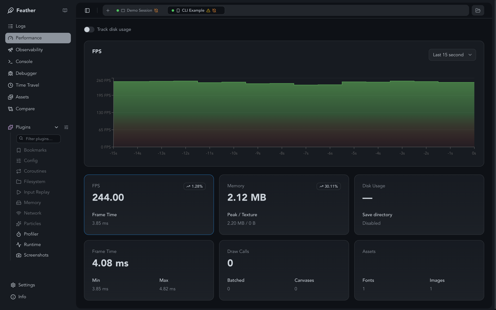
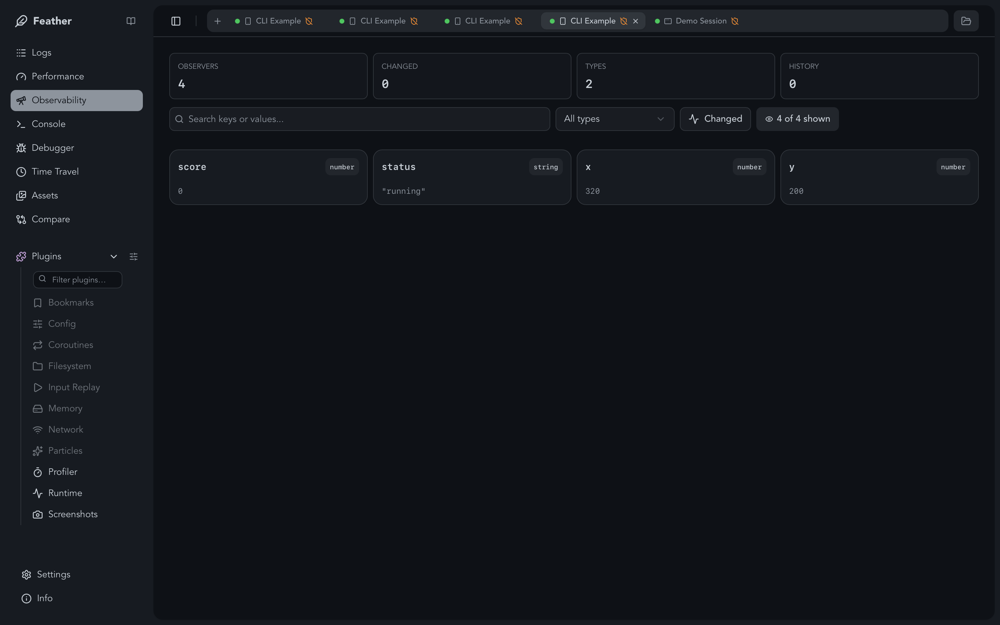

# Feather 🪶

**Real-time debug & inspect tool for [LÖVE (love2d)](https://love2d.org) games.**

Like Flipper or React DevTools, but for your game. Inspect logs, variables, performance metrics, and errors in real-time over a WebSocket connection — with a built-in plugin system, step debugger, and zero-config setup.

---

## Features

- 📜 **Live log viewer** — See `print()` output instantly in the app.
- 🔍 **Variable inspection** — Watch values update in real-time.
- 🚨 **Error capturing** — Catch and display errors automatically.
- 📸 **Screenshots & GIF capture** — Capture screenshots and record GIFs via the built-in plugin.
- 🔌 **Plugin system** — +18 built-in plugins + custom ones. Server-driven UI: plugins define their actions in Lua, the desktop renders them automatically.
- 📱 **Multi-session support** — Connect multiple games simultaneously, each gets its own session tab.
- 📲 **Mobile debugging** — Auto-detected local IP in Settings with copyable connection string.
- 💻 **Console / REPL** — Execute Lua code in the running game (opt-in, requires `apiKey`).
- 🐛 **Step Debugger** — Breakpoints, step over/into/out, call stack, and local variable inspection.
- 📁 **Log file viewer** — Open `.featherlog` files for offline inspection.
- ⚡ **Zero-config setup** — `require("feather.auto")` registers all plugins with sensible defaults.
- 📦 **One-line installer** — `curl | bash` script to download core + plugins on demand.

---

## Quick Start

```lua
require("feather.auto")

function love.update(dt)
  DEBUGGER:update(dt)
end
```

That's it. `DEBUGGER` is a global created automatically with all plugins registered.

**Customize:**

```lua
require("feather.auto").setup({
  sessionName = "My RPG",
  host = "192.168.1.50",             -- for mobile debugging
  exclude = { "network-inspector" },  -- skip specific plugins
  include = { "console" },            -- opt-in plugins
  pluginOptions = {
    bookmark = { hotkey = "f5" },
  },
})
```

---

## Documentation

- [Installation](installation.md) — Download, install script, LuaRocks, custom paths
- [Configuration](configuration.md) — All config options, connecting, mobile debugging
- [Usage](usage.md) — Observers, logging, console / REPL, step debugger
- [Plugins](plugins.md) — Built-in plugins, plugin system, custom plugins
- [Recommendations](recommendations.md) — Security, performance, release builds

---

## Screenshots




